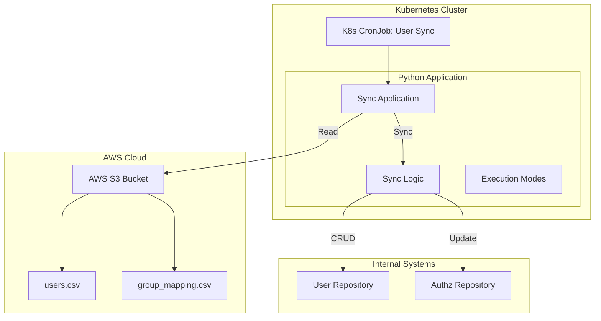
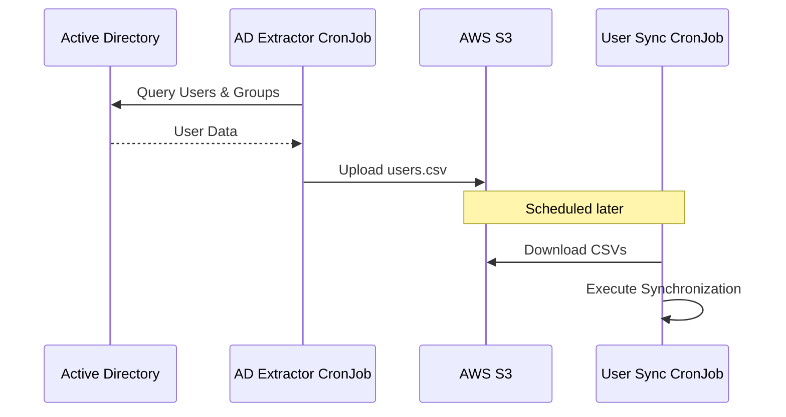

# Technical Proposal: AD Users Synchronization System

## 1. Executive Summary
This document outlines the architecture and design for a system to synchronize Active Directory (AD) users and their permissions with an internal authorization system. The system reads user and mapping data from CSV files stored in AWS S3 and executes synchronization logic to ensure the internal state matches the source of truth.

## 2. Architecture

### 2.1 Overview
The solution is designed as a containerized Python application running as a **Kubernetes CronJob**. It interacts with AWS S3 to retrieve input data and internal repositories to apply changes.

### 2.2 Components
- **Input Source (AWS S3)**: Stores the `users.csv` and `group_mapping.csv` files.
- **Execution Environment (Kubernetes)**:
    - **CronJob**: Schedules the execution of the synchronization process (e.g., nightly).
    - **Container**: Dockerized Python application containing the business logic.
- **Application Logic**:
    - **Parsers**: Validates and parses CSV inputs.
    - **Sync Engine**: Compares source data with internal state and determines necessary actions (Create, Update, Delete).

## 3. Business Logic
The synchronization process follows these steps:
1.  **Fetch**: Download CSV files from the configured S3 bucket.
2.  **Parse**: Read `users.csv` (User, Email, Group) and `group_mapping.csv` (Group, Namespace, Roles).
3.  **Sync Loop**:
    *   **Identify Removals**: Users present in the internal repository but missing from the AD CSV are **deleted**.
    *   **Identify Creations/Updates**: Iterate through AD CSV users:
        *   If the user does not exist internally, **create** them.
        *   Determine expected roles based on the Group -> Namespace/Roles mapping.
        *   Compare with current roles and **update** if necessary.
4.  **Reporting**: Generate a summary of actions taken (Processed, Created, Updated, Deleted, Skipped).

## 4. Validations (Non-Critical)
The system implements several safeguards. These validations can be bypassed in **Force** mode but will stop execution in **Normal** mode if violated.

1.  **Mass Deletion Protection**:
    - **Rule**: Do not remove more than **X%** (configurable, e.g., 20%) of the total user base in a single run.
    - **Reason**: Prevents accidental wiping of the user directory due to a corrupted or empty input file.

2.  **Email Validation**:
    - **Rule**: Users must have a syntactically valid email address.
    - **Action**: Users with invalid emails are skipped and logged.

3.  **Duplicate Detection**:
    - **Rule**: The input CSV must not contain duplicate user entries.
    - **Action**: Duplicates are flagged, and the execution may halt or skip duplicates depending on configuration.

## 5. Execution Modes
The application supports three distinct execution modes to ensure safety and flexibility:

| Mode | Description | Behavior |
| :--- | :--- | :--- |
| **Dry Run** | Simulation mode. | • Validates input files. • Calculates differences (Diff). • Logs what *would* happen. • **No changes** are applied to repositories. |
| **Normal** | Standard execution. | • Validates input files. • Applies changes (Create/Update/Delete). • Stops on critical validation errors. • Generates execution report. |
| **Force** | Emergency/Override mode. | • Attempts to proceed despite non-critical validation errors. • Useful for partial syncs or bypassing specific safety checks. • Applies changes and reports errors. |

## 6. Future Roadmap

### Phase 2: Automated AD Extraction
A second Kubernetes CronJob will be introduced to automate the generation of the source CSV file.

- **AD Extractor CronJob**: Connects directly to Active Directory via LDAP/Graph API, formats the data into the required CSV structure, and uploads it to S3.
- **Decoupling**: This separates the extraction complexity from the synchronization logic, allowing independent scaling and maintenance.
