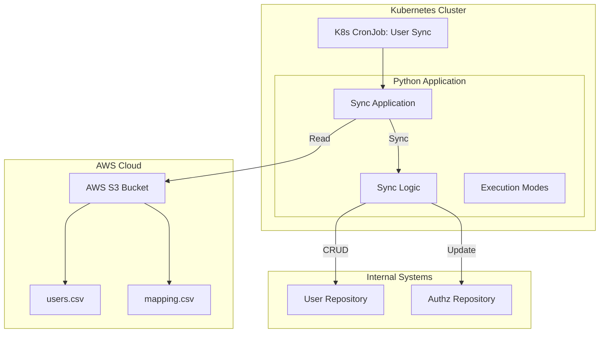
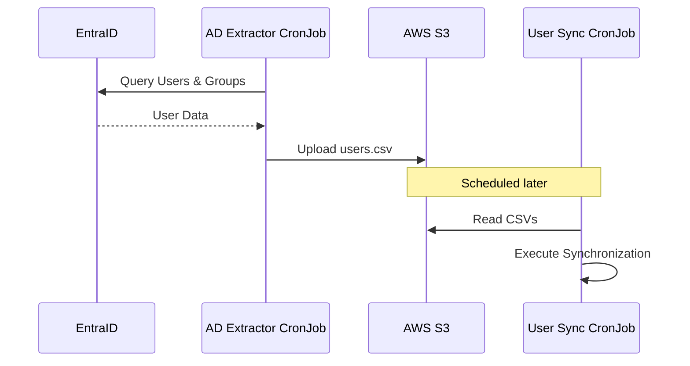

# Propuesta Técnica: Sistema de Sincronización de Usuarios AD

## 1. Resumen
Este documento describe la arquitectura y el diseño de un sistema para sincronizar usuarios de Entra ID y sus permisos con nullplatform. El sistema lee datos de usuarios y mapeos desde archivos CSV almacenados en AWS S3 y ejecuta la lógica de sincronización para asegurar que el estado interno coincida con la fuente de verdad.

## 2. Arquitectura

### 2.1 Visión General
La solución está diseñada como una aplicación Python containerizada que se ejecuta como un **Kubernetes CronJob**. Interactúa con AWS S3 para recuperar datos de entrada y APIs de nullplatform para aplicar cambios.

### 2.2 Componentes
- **Fuente de Entrada (AWS S3)**: Almacena los archivos `users.csv` y `mapping.csv`.
- **Entorno de Ejecución (Kubernetes)**:
    - **CronJob**: Programa la ejecución del proceso de sincronización (ej. cada hora).
    - **Contenedor**: Aplicación Python dockerizada que contiene la lógica de negocio.
- **Lógica de Aplicación**:
    - **Parsers**: Valida y parsea las entradas CSV.
    - **Motor de Sync**: Compara los datos fuente con el estado en las APIs de nullplatform y determina las acciones necesarias (Crear, Actualizar, Eliminar).

## 3. Lógica de Negocio
El proceso de sincronización sigue estos pasos:
1.  **Obtención**: Descargar archivos CSV del bucket S3 configurado, las rutas de los archivos estara determinada en configuracion.
2.  **Parseo**: Leer `users.csv` (Nombre, Correo, Grupo) y `mapping.csv` (Grupo, NRNs, Roles).
3.  **Ciclo de Sync**:
    *   **Identificar Eliminaciones**: Los usuarios presentes en nullplatform pero faltantes en el CSV de AD son **eliminados**, estos usuarios ya no podran ingresar a nullplatform hasta su reactivacion.
    *   **Identificar Creaciones/Actualizaciones**: Iterar a través de los usuarios del CSV de AD:
        *   Si el usuario no existe en nullplatform, **crearlo**.
        *   Si el usuario existe pero se encuentra desactivado, **reactivarlo**.
        *   Determinar roles esperados basados en el mapeo Grupo -> Namespaces/Roles.
        *   Comparar con roles actuales y **actualizar** o **elimina** si es necesario.
4.  **Reporte**: Generar un resumen de acciones tomadas (Procesados, Creados, Actualizados, Eliminados, Omitidos) en el mismo bucket de S3 donde se encuentran los inputs, en un folder llamado `/results`

## 4. Validaciones (No Críticas)
El sistema implementa varias salvaguardas. Estas validaciones pueden ser omitidas en modo **Force** pero detendrán la ejecución en modo **Normal** si se violan.

1.  **Protección contra Eliminación Masiva**:
    - **Regla**: No eliminar más del **X%** (configurable, ej. 20%) de la base total de usuarios en una sola ejecución.
    - **Razón**: Previene el borrado accidental del directorio de usuarios debido a un archivo de entrada corrupto o vacío.

2.  **Validación de Correo**:
    - **Regla**: Los usuarios deben tener una dirección de correo sintácticamente válida.
    - **Acción**: Los usuarios con correos inválidos son omitidos y registrados.

3.  **Detección de Duplicados**:
    - **Regla**: El CSV de entrada no debe contener entradas de usuarios duplicadas.
    - **Acción**: Los duplicados son marcados, y la ejecución puede detenerse u omitir duplicados dependiendo de la configuración.

4.  **Deteccion de cambios en los archivos de inputs**:
    - **Regla**: No ejecutar el flujo si los archivos no han sufrido cambios desde la ultima ejecucion.
    - **Razón**: Cada ejecucion guarda sus resultados en un archivo de S3 cuyo nombre resulta del md5 de los archivos de inputs, si ya existe una ejecucion para esa version de ambos archivos no se ejecuta el proceso.

## 5. Modos de Ejecución
La aplicación soporta tres modos de ejecución distintos para asegurar seguridad y flexibilidad:

| Modo | Descripción | Comportamiento |
| :--- | :--- | :--- |
| **Dry Run** | Modo simulación. | • Valida archivos de entrada. • Calcula diferencias (Diff). • Registra lo que *pasaría*. • **No se aplican cambios** en los sistemas de nullplatform. |
| **Normal** | Ejecución estándar. | • Valida archivos de entrada. • Aplica cambios (Crear/Actualizar/Eliminar). • Se detiene en errores de validación críticos. • Genera reporte de ejecución. |
| **Force** | Modo emergencia/override. | • Intenta proceder a pesar de errores de validación no críticos. • Útil para sincronizaciones parciales o para omitir chequeos de seguridad específicos. • Aplica cambios y reporta errores. |

## 6. Estructura de datos
Roles validos: developer, member, ops, secops, admin

### Fase 2: Extracción Automatizada de EntraID
Se introducirá un segundo Kubernetes CronJob para automatizar la generación del archivo CSV fuente.

- **AD Extractor CronJob**: Se conecta directamente a EntraID via API, formatea los datos en la estructura CSV requerida, y los sube a S3.
- **Desacoplamiento**: Esto separa la complejidad de extracción de la lógica de sincronización, permitiendo escalado y mantenimiento independientes.
