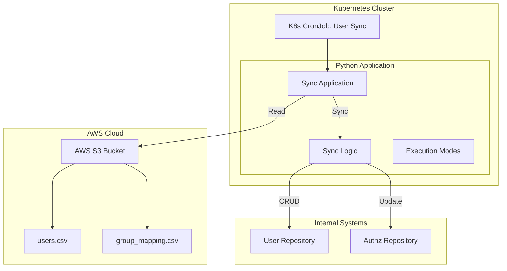
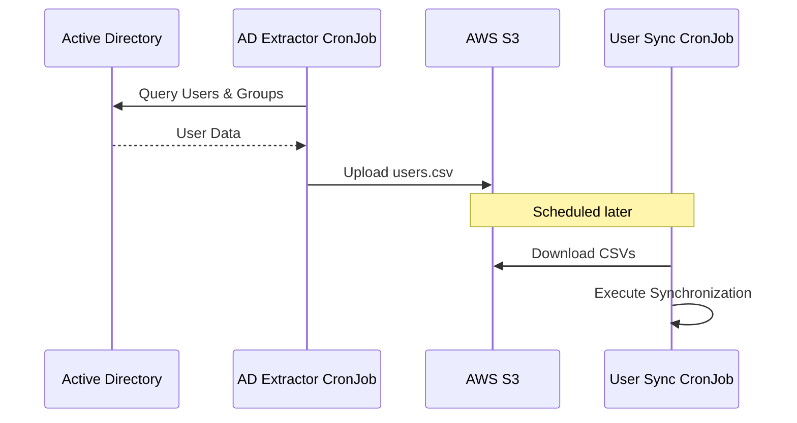

# Propuesta Técnica: Sistema de Sincronización de Usuarios AD

## 1. Resumen Ejecutivo
Este documento describe la arquitectura y el diseño de un sistema para sincronizar usuarios de Active Directory (AD) y sus permisos con un sistema de autorización interno. El sistema lee datos de usuarios y mapeos desde archivos CSV almacenados en AWS S3 y ejecuta la lógica de sincronización para asegurar que el estado interno coincida con la fuente de verdad.

## 2. Arquitectura

### 2.1 Visión General
La solución está diseñada como una aplicación Python containerizada que se ejecuta como un **Kubernetes CronJob**. Interactúa con AWS S3 para recuperar datos de entrada y repositorios internos para aplicar cambios.

### 2.2 Componentes
- **Fuente de Entrada (AWS S3)**: Almacena los archivos `ad_users_dump.csv` y `group_mapping.csv`.
- **Entorno de Ejecución (Kubernetes)**:
    - **CronJob**: Programa la ejecución del proceso de sincronización (ej. nocturno).
    - **Contenedor**: Aplicación Python dockerizada que contiene la lógica de negocio.
- **Lógica de Aplicación**:
    - **Parsers**: Valida y parsea las entradas CSV.
    - **Motor de Sync**: Compara los datos fuente con el estado interno y determina las acciones necesarias (Crear, Actualizar, Eliminar).

## 3. Lógica de Negocio
El proceso de sincronización sigue estos pasos:
1.  **Obtención**: Descargar archivos CSV del bucket S3 configurado.
2.  **Parseo**: Leer `ad_users_dump.csv` (Nombre, Correo, Grupo) y `group_mapping.csv` (Grupo, NRN, Roles).
3.  **Ciclo de Sync**:
    *   **Identificar Eliminaciones**: Los usuarios presentes en nullplatform pero faltantes en el CSV de AD son **eliminados**.
    *   **Identificar Creaciones/Actualizaciones**: Iterar a través de los usuarios del CSV de AD:
        *   Si el usuario no existe en nullplatform, **crearlo**.
        *   Determinar roles esperados basados en el mapeo Grupo -> Namespace/Roles.
        *   Comparar con roles actuales y **actualizar** si es necesario.
4.  **Reporte**: Generar un resumen de acciones tomadas (Procesados, Creados, Actualizados, Eliminados, Omitidos).

## 4. Validaciones (No Críticas)
El sistema implementa varias salvaguardas. Estas validaciones pueden ser omitidas en modo **Force** pero detendrán la ejecución en modo **Normal** si se violan.

1.  **Protección contra Eliminación Masiva**:
    - **Regla**: No eliminar más del **X%** (configurable, ej. 20%) de la base total de usuarios en una sola ejecución.
    - **Razón**: Previene el borrado accidental del directorio de usuarios debido a un archivo de entrada corrupto o vacío.

2.  **Validación de Correo**:
    - **Regla**: Los usuarios deben tener una dirección de correo sintácticamente válida.
    - **Acción**: Los usuarios con correos inválidos son omitidos y registrados.

3.  **Detección de Duplicados**:
    - **Regla**: El CSV de entrada no debe contener entradas de usuarios duplicadas.
    - **Acción**: Los duplicados son marcados, y la ejecución puede detenerse u omitir duplicados dependiendo de la configuración.

## 5. Modos de Ejecución
La aplicación soporta tres modos de ejecución distintos para asegurar seguridad y flexibilidad:

| Modo | Descripción | Comportamiento |
| :--- | :--- | :--- |
| **Dry Run** | Modo simulación. | • Valida archivos de entrada. • Calcula diferencias (Diff). • Registra lo que *pasaría*. • **No se aplican cambios** en los sistemas de nullplatform. |
| **Normal** | Ejecución estándar. | • Valida archivos de entrada. • Aplica cambios (Crear/Actualizar/Eliminar). • Se detiene en errores de validación críticos. • Genera reporte de ejecución. |
| **Force** | Modo emergencia/override. | • Intenta proceder a pesar de errores de validación no críticos. • Útil para sincronizaciones parciales o para omitir chequeos de seguridad específicos. • Aplica cambios y reporta errores. |

## 6. Estructura de datos
Roles validos: developer, member, ops, secops, admin

### Fase 2: Extracción Automatizada de AD
Se introducirá un segundo Kubernetes CronJob para automatizar la generación del archivo CSV fuente.

- **AD Extractor CronJob**: Se conecta directamente a Active Directory vía LDAP/Graph API, formatea los datos en la estructura CSV requerida, y los sube a S3.
- **Desacoplamiento**: Esto separa la complejidad de extracción de la lógica de sincronización, permitiendo escalado y mantenimiento independientes.
